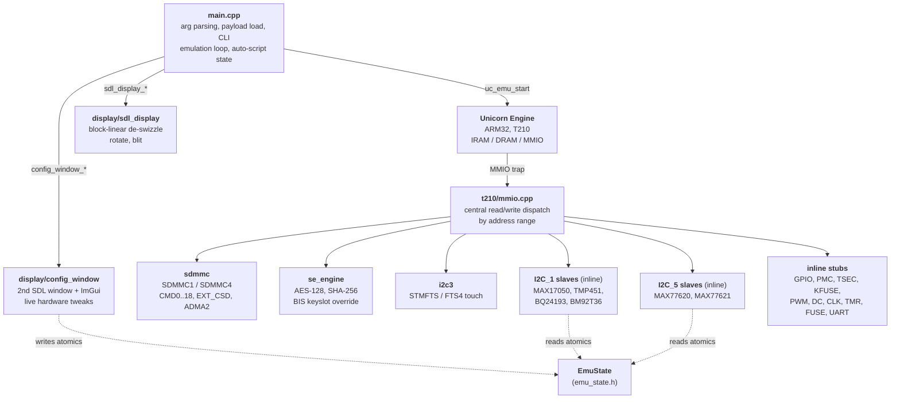

# RCM-Emulator Design

This document explains how the emulator is structured, which Tegra X1 (T210)
subsystems are modelled, and the non-obvious decisions or workarounds behind
them. Read [README.md](README.md) first for usage.

## High-level architecture



`EmuState` (`emu_state.h`) is the single shared struct. It holds button atomics,
touchscreen atomics, framebuffer parameters from the display controller, file
descriptors for SD and eMMC images, and a deterministic `emu_usec` counter used
for auto-script timing.

## Boot flow (Hekate as the example)

1. The payload is loaded into IRAM (Internal RAM) at `0x40010000` via
   `uc_mem_write`. We also pre-write the 4-byte cookie `0x544457` ("WDT") at
   IRAM offset `0x4003FF18`. Hekate reads that location during early boot.
   When the cookie is present, it takes the `goto skip_lp0_minerva_config`
   branch and skips loading both `libsys_lp0.bso` and the Minerva
   DRAM-training module. Real DRAM training would touch the EMC (External
   Memory Controller) and MC (Memory Controller), neither of which the
   emulator models. The matching exception-enable cookie at `0x4003FF1C`
   stays zero, so the "hang detected" warning is suppressed.
2. PC is set to `0x40010000`, SP to `IPL_STACK_ADDR`. CPSR enters ARM mode.
3. The IPL (Initial Program Loader) initialises clocks, fuses and the display,
   then continues straight into the boot menu without loading LP0 or Minerva.
4. Hekate self-relocates into DRAM (`0xC0000000+`) and continues. The display
   pipeline resamples its DRAM-side framebuffer parameters.
5. Nyx (the LVGL graphics stack) initialises and draws into a separate FB. The
   DC (Display Controller) `WINDOW_HEADER` register tracks the currently
   primary surface. The display code follows that pointer.

## Memory map

Mapped explicitly in `setup_emulation()`:

| Range                       | Size    | Purpose                             |
| --------------------------- | ------- | ----------------------------------- |
| `0x40000000 – 0x40040000`   | 256 KB  | IRAM (payload + IPL stack)          |
| `0x80000000 – 0x90000000`   | 256 MB  | DRAM low                            |
| `0xC0000000 – 0xFFFFFFFF`   | 1 GB    | DRAM high (covers FB at 0xF5A00000) |
| `0x00000000 – 0x01000000`   | 16 MB   | low scratch (some null derefs)      |
| Various MMIO pages          | 4 KB ea | trapped via UC hooks                |

MMIO (Memory-Mapped I/O) ranges are added as plain mapped pages with read and
write hooks. The actual register modelling lives in `t210/mmio.cpp`.

## Subsystems

### SDMMC1 (SD) and SDMMC4 (eMMC)

Implemented in `t210/sdmmc.cpp` plus inline handlers in `t210/mmio.cpp`. Enough
of the spec is modelled for the Hekate, Lockpick and TE init paths:

- CMD0 GO_IDLE, CMD1 SEND_OP_COND, CMD2 ALL_SEND_CID, CMD3 SEND_RELATIVE_ADDR,
  CMD6 SWITCH, CMD7 SELECT_CARD, CMD8 SEND_EXT_CSD (eMMC) or SEND_IF_COND (SD),
  CMD9 SEND_CSD, CMD13 SEND_STATUS, CMD16 SET_BLOCKLEN, CMD17 and CMD18
  READ_(MULTI_)BLOCK, CMD55 APP_CMD.
- ADMA2 (Advanced DMA 2) with 64-bit descriptors, multi-block reads chunked
  into the host file IO via `pread`-style calls.
- `--rawnand` opens the matching `rawnand.bin.NN` chunks and `fstat`s the first
  one to derive the per-chunk size automatically. Typical dumps are 2 GB or
  4 GB chunks.

#### Gotchas

- **CMD3 R6 vs R1.** Hekate expects an SD R6 (RCA, Relative Card Address, in
  the upper half). eMMC reads it as R1 status. R1 with bit 16 set
  (`CID_CSD_OVERWRITE`) makes Lockpick bail before `CMD9`. The handler splits
  on the controller base.
- **CMD9 mmca_vsn.** Hekate left-shifts the CSD response by 8 (CRC strip), so
  bits 18..21 of `rsp[3]` need to encode 4. The handler hardcodes
  `rsp[3] = 0x16504000`.
- **CMD8 EXT_CSD.** TE polls `TRANSFER_COMPLETE` until it sees DMA-delivered
  data. The handler synthesises a 512-byte payload (REV=7, CARD_TYPE=0x57, fake
  sec_cnt) and writes it via the configured ADMA2 descriptor before raising
  the IRQ.

### Security Engine (`t210/se_engine.cpp`)

Models the SE (Security Engine) register block at `0x70012000`. Supports:

- **AES-128 ECB, CBC, CTR, CMAC.** The compact public-domain TinyAES core
  ([kokke/tiny-AES-c](https://github.com/kokke/tiny-AES-c)) drives one block
  at a time, with chaining state taken from `IV_ORIGINAL` or `IV_UPDATED` per
  slot and `xor_pos` from `CRYPTO_CONFIG`.
- **SHA-256.** Implemented because the TE function `save_process_header`
  validates the save container hash. Without it, `readsave()` returns
  `Error: Save header is invalid!`. Oneshot only: one IN_LL buffer at a time,
  written into the `HASH_RESULT` registers as 8 big-endian dwords (the BDK
  driver byte-swaps on read).
- **DST_KEYTABLE unwrap path.** When the destination is another keyslot, the
  result of a single block is written into the destination `KEYS_0_3` or
  `KEYS_4_7` register pair.
- **`--prod-keys` BIS override.** When Lockpick writes the last word of a
  derived BIS (Boot Image Storage) key into slots 0..5, the value from the
  user-supplied key file is substituted. This sidesteps the
  TSEC-firmware to `master_kek` to `master_key` derivation chain that is not
  fully modelled. For other keyslots, the SE behaves normally.

The 16 keyslots are stored in a flat `Keyslot ks_table[16]` with
`key[32] / iv_orig[16] / iv_upd[16]`. RSA, RNG, and chunked SHA are stubbed.
They return `OP_DONE` without producing data, which is enough for current
payloads.

### Touchscreen (`t210/i2c3.cpp`)

Stub of the STMFTS controller at I²C address `0x49` on I²C3. SDL mouse events
are translated into FTS4 `MULTI_TOUCH_ENTER`, `MOTION` and `LEAVE` records
with a 1-indexed finger ID, then queued via the atomic flags in `EmuState`.
The CPU thread drains them on the next I²C read.

### GPIO buttons and MAX77620 PMIC

`btn_vol_up`, `btn_vol_down` and `btn_power` are atomic bools updated by the
SDL keyboard handler. The MMIO read handlers map them onto:

- VOL+ and VOL– map to GPIO X6 and X7 (active-low) on port X.
- POWER routes through the MAX77620 PMIC (Power Management IC), reported via
  `ONOFFSTAT.EN0` over I²C5.
- GPIO Port Z bit 1 reflects `state->sd_inserted` (active-low). Toggle it from
  the config window to simulate SD eject mid-boot.

### I²C-attached chips (battery, charger, thermal, USB-PD, PMIC ID)

Modelled inline in `t210/mmio.cpp::i2c_read`. The bus is disambiguated by
`bool on_i2c5 = (addr >= I2C5_BASE)`, which lets the same slave address
serve different chips on different buses. The Synaptics RMI4 stub on I²C1
@ 0x4C was retired once `i2c3.cpp` took over real touch handling, and
TMP451 took the freed address.

| Chip       | Bus / addr     | Reg dispatch                                        |
| ---------- | -------------- | --------------------------------------------------- |
| MAX17050   | I²C\_1 @ 0x36  | "Small" path (CMD\_DATA1 read), 13 regs handled     |
| TMP451     | I²C\_1 @ 0x4C  | Small path; int byte + frac-nibble per channel      |
| BQ24193    | I²C\_1 @ 0x6B  | Small path; 7 regs reverse-encoded from EmuState    |
| BM92T36    | I²C\_1 @ 0x18  | Packet-mode path (TX\_FIFO/RX\_FIFO FSM)            |
| MAX77620   | I²C\_5 @ 0x3C  | Small path; ONOFFSTAT + CID3/CID4/CID5              |
| MAX77621   | I²C\_5 @ 0x1B  | Small path; CHIPID1                                 |

Every register handler reverse-encodes the user-facing decoded value
(stored in `EmuState`) to match the chip's raw register format that the
Hekate `bdk/power/*.c` drivers expect. A slider that reads "2000 mA"
maps to the BQ24193 INLIMIT bucket whose decode formula yields back
2000 mA. Round-trip clean. The encoders mirror the `*_get_property()`
formulas in Hekate. If those units change upstream, re-derive ours from
the same source.

#### Packet-mode I²C (BM92T36)

Most slaves on the Switch use Hekate's "small" I²C transactions: write a
register byte, read 1–4 bytes back via `CMD_DATA1`. BM92T36 (USB-PD,
USB Power Delivery) uses the Tegra packet mode instead. A 3-word header
is streamed into `TX_FIFO`, then the CPU drains data from `RX_FIFO`
while polling `FIFO_STATUS`. `mmio.cpp` carries a per-bus `PacketState`
FSM (Finite State Machine):

1. Watch `TX_FIFO` writes. The PROT magic word (`BIT(4)`) starts a new
   packet, and subsequent words are `(size-1, header, payload…)`.
2. The header word carries `dev_addr` and a `READ` flag.
3. On a read header, populate a 64-byte `rx_buf` for the slave/register
   pair. Currently only BM92T36 needs this (`bm92t36_fill_rx`).
4. `RX_FIFO` reads drain `rx_buf` 4 bytes at a time.
   `PACKET_TRANSFER_STATUS` returns `(payload_size - 1) << 4` so the
   Hekate wait loop exits immediately.

Adding a new packet-mode slave is one extra branch in `packet_populate_rx`
plus a `<slave>_fill_rx` helper.

### Live config window (`display/config_window.cpp`)

A second SDL window (`SDL_WINDOW_HIDDEN` until the user presses `M`)
hosting Dear ImGui sliders, combos and hex inputs. Edits write directly
to the `EmuState` atomics that the I²C, GPIO and fuse handlers read on
each register access. Two cooperative pieces:

- Window dispatch. `display/sdl_display.cpp::sdl_display_poll_events`
  inspects each SDL event's `windowID`. Events targeting the config
  window are forwarded to `config_window_handle_event`, which feeds the
  ImGui SDL2 backend. Events targeting the main window run through the
  existing Switch-button handlers.
- Lifecycle. `main.cpp` calls `config_window_init` once after
  `sdl_display_init`, calls `config_window_render` in the same 16 ms
  display tick, and calls `config_window_shutdown` before the SDL display
  tear-down.

`SDL_QUIT` only fires when the last window closes. The main poll loop
also catches `SDL_WINDOWEVENT_CLOSE` on the main window ID and treats it
as quit. The config window's close button just hides it (`M` reopens).

ImGui ships as a git submodule under `third_party/imgui`. A shallow
clone is sufficient. Only the `imgui_*.cpp` core plus the SDL2 and
SDL\_Renderer2 backends are compiled in (not the demo). The Makefile
lists those sources explicitly, so later additions like `imgui_demo.cpp`
do not auto-creep into the build.

### Display pipeline (`display/sdl_display.cpp`)

Hekate and Nyx draw into a block-linear surface. One block-height row covers
16 GOBs (Group Of Bytes, NVIDIA's 64 by 8 pixel tile). The display thread:

1. Reads DC `WINDOW_HEADER` to follow the active surface (Window A, B, C or
   D).
2. Looks up the FB pointer, stride and GOB block height latched from
   `DC_WIN_x_SURFACE_KIND`.
3. De-swizzles into a linear RGBA buffer using a per-pixel address calc.
4. Optionally rotates 0, 90, 180 or 270 degrees to match the panel orientation
   detected from window dimensions, with an `R` or `Shift+R` manual override.
5. Blits to an SDL_Texture at the host window current size.

The de-swizzle is the hottest path. It is inlined and operates on `u32`
units. A blit cache keys on `(addr, w, h, stride, sw, rot, bh)` so identical
frames don't re-touch the surface.

### UART

`UART_A` at `0x70006000`. Writes to `THR` (Transmit Holding Register) are
buffered into a 512-byte line and flushed on `\n`, `\r`, or buffer overflow as
a single `[uart] …` host stdout line. Bytes outside the printable range
`0x20..0x7E` (typically Joy-Con HID frames Hekate also drives over UART) are
dropped to keep the log readable.

For TE, `gfx_putc` was patched in TE source to mirror each FB-bound character
to `UART_A`, so script `print` and `println` calls show up directly in
`out.log` without needing to OCR the framebuffer. That patch lives in the
TegraExplorer tree, not this repo.

### Other peripherals (mostly stubs)

- **PLLs.** Reads on `PLL_BASE` registers return `ENABLE | LOCK` for any of
  the PLLs Minerva polls during DRAM training.
- **KFUSE.** `STATE` returns `DONE | CRCPASS` immediately so the BDK function
  `kfuse_wait_ready` doesn't hang.
- **TSEC.** `DMATRFCMD_IDLE` is reported set, and the keygen status word is
  hardcoded to `0xB0B0B0B0` (the success magic from AMS, the Atmosphère
  keygen). No firmware is actually executed.
- **Timer and RTC.** Backed by `EmuState::emu_usec`, incremented per CPU
  batch by a fixed amount so timing is deterministic across runs. The
  auto-script feature relies on this.
- **Probe-magic constants.** Several reads return fixed values, not because
  they are tweakable but because the chip-detection code expects exact
  cookies: `MAX17050.DevName=0x00AC`, `BQ24193.VendorPart=0x2F`, the BM92T36
  `FW_TYPE`/`MAN_ID`/`DEV_ID` triple, `TSEC.STATUS=0xB0B0B0B0`,
  `KFUSE.STATE=DONE|CRCPASS`, `PLL_BASE=ENABLE|LOCK`. Changing them breaks
  the Hekate init path. They are hardcoded by design.

## Determinism and the auto-script flag

`emu_usec` advances by a constant per Unicorn batch, never by host wall-clock.
That makes the entire run reproducible: a payload at PC X always sees timer
value Y, regardless of how busy the host machine is.

The `--auto-pin-recovery` and `--auto-te-script` flags exploit this. A real
interactive run was captured by logging every keyboard up and down event with
the matching `emu_usec`, then the same schedule was re-applied verbatim in
`main.cpp`:

```cpp
struct InputEv { uint64_t at_us; char btn; bool down; };
static const InputEv te_events[] = {
    {3480000,  'P', true},  {3640000,  'P', false},
    {10080000, 'D', true},  {10460000, 'D', false},
    /* …32 events total… */
};
while (te_idx < n && state.emu_usec >= te_events[te_idx].at_us) {
    apply event;
}
```

Because `emu_usec` is deterministic, the same timestamps land at the same UI
states across runs. Adding a new automated flow is "press the buttons once
with `[input]` logging on, copy the timestamps".

## Bug history

These are baked into the current source. Listed here so future maintainers
don't repeat the diagnosis:

- **Minerva DRAM training** hangs in a `PLL_BASE.LOCK` poll. Fix: always
  report `LOCK | ENABLE`.
- **`kfuse_wait_ready`** loops on `STATE.DONE`. Fix: stub `DONE | CRCPASS`.
- **AMS keygen** retries `tsec_query` 15 times until timeout. Fix: stub
  `STATUS = 0xB0B0B0B0`.
- **CMD3 over eMMC** must emit R1 status, not R6, and must not raise
  `CID_CSD_OVERWRITE`. Lockpick bails out before `CMD9` otherwise.
- **CSD `mmca_vsn`** has to compensate for the Hekate `<< 8` shift on the
  response word. Bits 18..21 of `rsp[3]` need to encode `4`.
- **CMD8 SEND_EXT_CSD** never fires `TRANSFER_COMPLETE` if no DMA payload is
  written. Lockpick polls forever, then falls through with `initialized = 0`,
  silently failing every subsequent `sdmmc_storage_read`.
- **GPP chunk size** was hardcoded to 4 GB initially and broke 2 GB dumps.
  Now `fstat`-derived from `rawnand.bin.00`.
- **Save header SHA-256** rejected by TE because the SE only modelled AES.
  Hence the SHA-256 path in `se_engine.cpp`.

See `git log` for the commit-by-commit diagnosis trail if you want more
detail on any of them.

## Adding a new peripheral

1. Decide on an MMIO range and add a new `else if` branch in `mmio_read` or
   `mmio_write` (or a dedicated module like `i2c3.cpp`).
2. If the device participates in the boot fence (status registers polled by
   the BDK), make sure the read returns the "ready" or "done" state. Silent
   `0` returns are the most common cause of hangs.
3. If it consumes data via DMA, model the LL descriptor at `IN_LL_ADDR` or
   `OUT_LL_ADDR` and use `uc_mem_read` and `uc_mem_write` to move guest
   memory.
4. Add logging behind `printf` with a clear prefix (`[se]`, `[sdmmc]`, etc.)
   so `out.log` stays greppable.

## Adding a new auto-script

1. Run interactively with `[input]` logging enabled (already on by default).
2. Tail the resulting `out.log` for `^\[input\]` lines to extract
   `(emu_usec, button, edge)` triples.
3. Drop them into a new array beside `te_events[]` in `main.cpp` and gate it
   behind a new CLI flag.
