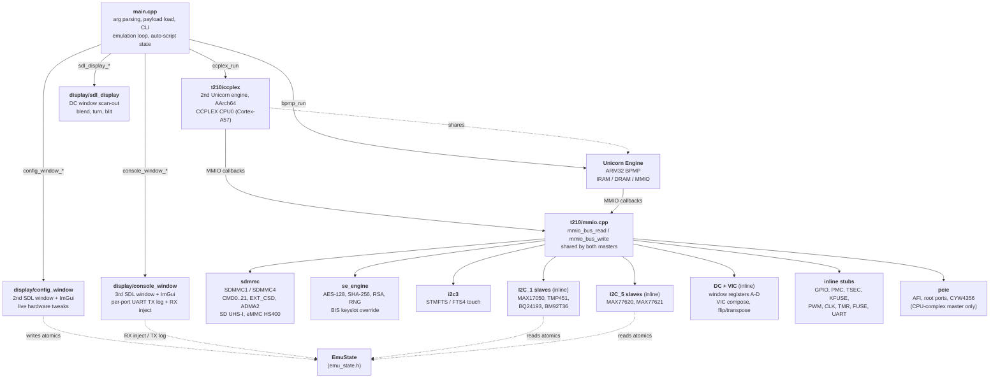

# RCM-Emulator Design

This document explains how the emulator is structured, which Tegra X1 (T210)
subsystems are modelled, and the non-obvious decisions or workarounds behind
them. Read [README.md](README.md) first for usage.

## High-level architecture


```mermaid
flowchart TB
    main["<b>main.cpp</b><br/>arg parsing, payload load, CLI<br/>emulation loop, auto-script state"]

    main -->|bpmp_run| uc["<b>Unicorn Engine</b><br/>ARM32 BPMP<br/>IRAM / DRAM / MMIO"]
    main -->|ccplex_run| a57["<b>t210/ccplex</b><br/>2nd Unicorn engine, AArch64<br/>CCPLEX CPU0 (Cortex-A57)"]
    a57 -->|MMIO callbacks| mmio
    a57 -.->|shares| uc
    main -->|sdl_display_*| sdl["<b>display/sdl_display</b><br/>DC window scan-out<br/>blend, turn, blit"]
    main -->|config_window_*| cfg["<b>display/config_window</b><br/>2nd SDL window + ImGui<br/>live hardware tweaks"]
    main -->|console_window_*| con["<b>display/console_window</b><br/>3rd SDL window + ImGui<br/>per-port UART TX log + RX inject"]

    uc -->|MMIO callbacks| mmio["<b>t210/mmio.cpp</b><br/>mmio_bus_read / mmio_bus_write<br/>shared by both masters"]

    mmio --> sdmmc["<b>sdmmc</b><br/>SDMMC1 / SDMMC4<br/>CMD0..21, EXT_CSD, ADMA2<br/>SD UHS-I, eMMC HS400"]
    mmio --> se["<b>se_engine</b><br/>AES-128, SHA-256, RSA, RNG<br/>BIS keyslot override"]
    mmio --> i2c["<b>i2c3</b><br/>STMFTS / FTS4 touch"]
    mmio --> i2c1["<b>I2C_1 slaves</b> (inline)<br/>MAX17050, TMP451,<br/>BQ24193, BM92T36"]
    mmio --> i2c5["<b>I2C_5 slaves</b> (inline)<br/>MAX77620, MAX77621"]
    mmio --> dc["<b>DC + VIC</b> (inline)<br/>window registers A-D<br/>VIC compose, flip/transpose"]
    mmio --> stubs["<b>inline stubs</b><br/>GPIO, PMC, TSEC, KFUSE,<br/>PWM, CLK, TMR, FUSE, UART"]
    mmio --> pcie["<b>pcie</b><br/>AFI, root ports, CYW4356<br/>(CPU-complex master only)"]

    cfg -.->|writes atomics| state["<b>EmuState</b><br/>(emu_state.h)"]
    con -.->|RX inject / TX log| state
    i2c1 -.->|reads atomics| state
    i2c5 -.->|reads atomics| state
```

`EmuState` (`emu_state.h`) is the single shared struct. It holds button atomics,
touchscreen atomics, framebuffer parameters from the display controller, file
descriptors for SD and eMMC images, and a deterministic `emu_usec` counter used
for auto-script timing.

Two processors can execute: the BPMP, which every RCM payload runs on, and -
once a payload boots it - CPU0 of the CCPLEX. Each is its own Unicorn engine;
both map the same host memory for IRAM, DRAM and TZRAM, and both reach the
same peripheral models through one dispatch (see [CCPLEX CPU0](#ccplex-cpu0)).

## Boot flow (Hekate as the example)

1. The payload is loaded into IRAM (Internal RAM) at `0x40010000` via
   `uc_mem_write`. Nothing else is planted: IRAM holds what it holds after a
   cold boot.
2. PC is set to `0x40010000`, SP to `IPL_STACK_ADDR`. CPSR enters ARM mode.
3. The IPL (Initial Program Loader) initialises clocks, fuses, the DRAM
   (`sdram_init`, at 204 MHz) and the display, mounts the SD card, loads
   `bootloader/sys/libsys_lp0.bso` (it saves the LP0 SDRAM config to PMC
   scratch) and trains the DRAM with Minerva
   (`bootloader/sys/libsys_minerva.bso`) at 204, 800 and 1600 MHz, all as on
   hardware (see [EMC and DRAM clock](#emc-and-dram-clock)). An SD image
   without those modules gets hekate's "Missing LP0 (sleep) lib! / Missing
   Minerva lib!" screen, which waits for a key press before the menu.
   hekate prints "Missing Minerva lib!" for any Minerva failure, not only a
   missing file: Minerva also refuses to start unless HIDREV reads chip
   0x21 and `FUSE_SKU_INFO` (0x110) reads 0x83 (ODIN). Both hold by
   default; a `[fuses]` edit to 0x110 in the config window or
   `rcm_emu.ini` brings the screen back.
4. Hekate self-relocates into DRAM (`0xC0000000+`) and continues. It points
   DC (Display Controller) window A at its portrait framebuffer and draws its
   boot logo and menus there, sideways, for the landscape-mounted panel.
5. Nyx (the LVGL GUI) takes over the trained Minerva context and from then
   on alternates the DRAM between 1600 and 800 MHz on every GUI loop to save
   power. It draws landscape into a second framebuffer and has VIC
   turn every frame into the portrait surface that window A scans out. The
   display follows the DC's windows, whatever they point at (see Display
   pipeline).

## Memory map

Mapped explicitly in `setup_emulation()`:

| Range                       | Size    | Purpose                             |
| --------------------------- | ------- | ----------------------------------- |
| `0x40000000 – 0x40040000`   | 256 KB  | IRAM (payload + IPL stack)          |
| `0x80000000 – 0x90000000`   | 256 MB  | DRAM low                            |
| `0xC0000000 – 0xFFFFFFFF`   | 1 GB    | DRAM high (covers FB at 0xF5A00000) |
| `0x00000000 – 0x01000000`   | 16 MB   | low scratch (some null derefs)      |
| `0x7C010000 – 0x7C020000`   | 64 KB   | TZRAM (shared with CPU0)            |
| Peripheral windows          | 4 KB ea | `uc_mmio_map` callbacks             |

MMIO (Memory-Mapped I/O) windows are `uc_mmio_map()` regions: Unicorn calls
`mmio_cb_read` / `mmio_cb_write`, which forward to `mmio_bus_read` /
`mmio_bus_write` in `t210/mmio.cpp`, where the register models live. The list
of windows is `kRegions` in the same file; it is flattened to 4 KiB pages and
mapped as contiguous runs, once per engine.

They used to be plain RAM pages with `UC_HOOK_MEM_READ` / `UC_HOOK_MEM_WRITE`
hooks, a read's result written into the page with `uc_mem_write` before the
load completed. Unicorn sends every guest load and store through its slow path
while any memory hook exists, so ordinary IRAM/DRAM traffic paid for MMIO's
hooks, and each MMIO read cost a walk of Unicorn's region list on top. An
unmapped access in the peripheral band now gets an MMIO page of its own on the
fly (`hook_unmapped`), so the generic register cache still sees it.

The "read back what was written" behaviour of simple registers (PINMUX, PWM,
UART LCR, CLK_SOURCE_* ...) comes from `mmio_regs`, a `RegCache`
(`t210/regcache.h`): flat 4 KiB pages with a presence bitmap and a last-page
cache, replacing a `std::map` that was a measurable share of all MMIO time.

## Subsystems

### SDMMC1 (SD) and SDMMC4 (eMMC)

Implemented in `t210/sdmmc.cpp` plus inline handlers in `t210/mmio.cpp`. Enough
of the spec is modelled for the Hekate, Lockpick and TE init paths:

- CMD0 GO_IDLE, CMD1 SEND_OP_COND, CMD2 ALL_SEND_CID, CMD3 SEND_RELATIVE_ADDR,
  CMD6 SWITCH, CMD7 SELECT_CARD, CMD8 SEND_EXT_CSD (eMMC) or SEND_IF_COND (SD),
  CMD9 SEND_CSD, CMD13 SEND_STATUS, CMD16 SET_BLOCKLEN, CMD17 and CMD18
  READ_(MULTI_)BLOCK, CMD11 VOLTAGE_SWITCH, CMD19 / CMD21 SEND_TUNING_BLOCK,
  CMD55 APP_CMD.
- ADMA2 (Advanced DMA 2) with 64-bit descriptors, multi-block reads chunked
  into the host file IO via `pread`-style calls.
- `--rawnand` opens the matching `rawnand.bin.NN` chunks and `fstat`s the first
  one to derive the per-chunk size automatically. Typical dumps are 2 GB or
  4 GB chunks.

#### Gotchas

- **CMD3 R6 vs R1.** Hekate expects an SD R6 (RCA, Relative Card Address, in
  the upper half). eMMC reads it as R1 status. R1 with bit 16 set
  (`CID_CSD_OVERWRITE`) makes Lockpick bail before `CMD9`. The handler splits
  on the controller base.
- **CMD9 mmca_vsn.** Hekate left-shifts the CSD response by 8 (CRC strip), so
  bits 18..21 of `rsp[3]` need to encode 4. The handler hardcodes
  `rsp[3] = 0x16504000`.
- **CMD8 EXT_CSD.** TE polls `TRANSFER_COMPLETE` until it sees DMA-delivered
  data. The handler synthesises a 512-byte payload (REV=7, CARD_TYPE=0x57, fake
  sec_cnt) and writes it via the configured ADMA2 descriptor before raising
  the IRQ.

#### Host controller registers and HS400

Each controller keeps its SDHCI registers (0x28-0x3F: power, clock, software
reset, HOST_CONTROL2) and Tegra's vendor block (0x100-0x1FF) in a register
file with the TRM's reset values, plus the side effects bdk waits on:

- CLOCK_CONTROL reports INTERNAL_CLK_STABLE once INT_CLK_EN is set.
  SOFTWARE_RESET's bits self-clear. RESET_ALL puts the standard registers
  back to reset and leaves the vendor block alone.
- AUTO_CAL_CONFIG.START and DLLCAL_CFG.CALIBRATE self-clear, and the status
  registers report the calibration done.
- Setting HOST_CONTROL2.EXEC_TUNING starts tuning. Each CMD19/CMD21 tries one
  tap: with TAP_VAL_UPDATED_BY_HW the taps step from TUNING_CNTRL0.START_TAP
  by TUNING_CNTRL1's step size, otherwise the tap in VENDOR_CLOCK_CNTRL is
  used. A tap passes when it falls in the modelled data eye, taps 26..82.
  After NUM_TUNING_ITERATIONS commands EXEC_TUNING clears and TUNED_CLK is
  set. The pass map lands in TUNING_STATUS0, and the chosen tap, first +
  (last - first) x (MUL_M + 1) / 2^DIV_N (TRM 32.9.2.14), lands in
  VENDOR_CLOCK_CNTRL. The tuning block's BUFFER_READ_READY is held until the
  card clock is re-enabled, the order in which bdk's tuning loop waits.
- EXT_CSD is one 512-byte array that lives for a power cycle. CMD6 SWITCH
  (write byte, set bits or clear bits) changes the bytes eMMC 5.1 makes
  writable (BUS_WIDTH, HS_TIMING, PARTITION_CONFIG and a few more). CMD8
  returns the array and CMD0 puts the card-reset fields back. CARD_TYPE
  advertises HS400 at 1.8 V, so bdk goes 8-bit, then HS200 (tuned), then
  HS400, and reports a 199.68 MHz card clock. BOOT0, BOOT1 and RPMB are
  4 MiB each, as on a Switch.

#### The SD card: UHS-I

The SD card is a UHS-I card (SD Physical Layer 3.01), so bdk runs it at
SDR104 like the real slot:

- ACMD41 with S18R answers S18A while the card still signals at 3.3 V, and
  CMD11 moves it to 1.8 V. It stays there until it loses power: bdk's
  supply GPIO (PE4) going low, or a reset. A card re-initialised without a
  power cycle answers S18A = 0 but keeps offering its UHS speeds.
- CMD6 (SWITCH_FUNC) reports and selects a function per group, per SD
  4.3.10: bus speed (SDR12 and SDR25/HS, plus SDR50, SDR104 and DDR50 at
  1.8 V), driver strength and power limit. CMD0 puts the functions back to
  their defaults, not the voltage.
- CMD19 tunes the SDR104 sampling point through the same tuning circuit as
  the eMMC. hwtest reports a 199.68 MHz card clock.
- The CSD is an SD CSD 2.0 (SD 5.3.3): the image's size (32 GiB with none)
  and command classes that include class 8, so bdk reads the SD status.
  That (ACMD13) reports the bus width ACMD6 set and a Class 10, U1, V10
  card with 4 MB AUs; the SCR sets SD_SPEC3.

### EMC and DRAM clock

The EMC (External Memory Controller, `t210/mmio.cpp`) is a register file -
reads return what was written, as `sdram_init` programmed it from the BCT -
with the controller's own behaviour on top (TRM 18.11). That is what bdk's
mode-register reads and Minerva, hekate's DRAM training and
frequency-switching module, depend on:

- **Banks.** A write to the broadcast bank (`EMC_BASE`) reaches both
  channels; `EMC0_BASE` / `EMC1_BASE` address one channel each.
- **Mode registers.** MRWs (`EMC_MRW`, `EMC_MRW2..15`) are remembered. An
  MRR latches the answer into the channel's `EMC_MRR` and sets
  `EMC_EMC_STATUS.MRR_DIVLD` until it is read. MR4 reports a normal
  temperature, MR5-8 the configured DRAM ID, and MR18/MR19 the DQS interval
  oscillator count: MR23's run time at the current DRAM clock over twice a
  400 ps tDQS2DQ. Minerva divides by that count.
- **Digital DLL.** `EMC_DIG_DLL_STATUS` reports lock as soon as the DLL is
  (re)started; `EMC_CFG_DIG_DLL.CFG_DLL_EN` reads back as written, which is
  what Minerva spins on around each DLL restart.
- **Clock change.** A new source or divisor in CAR `CLK_SOURCE_EMC` (TRM
  5.2.73) is the CAR/EMC handshake: the EMC replays the writes queued in its
  clock-change FIFO (`EMC_CCFIFO_DATA` / `_ADDR`) and raises
  `CLKCHANGE_COMPLETE` in `EMC_INTSTATUS`. The DRAM clock follows from
  `CLK_SOURCE_EMC` and the PLLM / PLLMB dividers; `PLLMB_BASE` (TRM 5.2.230)
  locks once enabled, like the other PLLs.
- **Status.** `EMC_EMC_STATUS` otherwise reports timing updates done, the
  DRAM active and the state machines idle.
- **Measured clock.** bdk's PTO counter measures the EMC at the modelled
  clock (the measured 204 MHz figure at the boot clock).
- **Not modelled.** The DLL's delay code (`DLL_OUT`) reads 0: the TRM gives
  no tap delay to derive it from.

With the stock `bootloader/` folder, hekate's IPL trains 204, 800 and
1600 MHz, and Nyx then switches between 800 and 1600 MHz on every GUI loop,
each switch a full handshake with a CCFIFO replay.

### Security Engine (`t210/se_engine.cpp`)

Models the SE (Security Engine) register block at `0x70012000`. Supports:

- **AES-128 ECB, CBC, OFB, CTR, CMAC.** The compact public-domain TinyAES
  core ([kokke/tiny-AES-c](https://github.com/kokke/tiny-AES-c)) drives one
  block at a time through the SE's datapath: `INPUT_SEL` picks memory, the
  previous AES output (OFB) or the linear counter (CTR); `XOR_POS` puts the
  vector RAM before the core (CBC encrypt) or the vector / the memory data
  after it (CBC decrypt, OFB, CTR); `VCTRAM_SEL` says what the vector becomes
  next. The vector starts from the slot's `IV_ORIGINAL` or `IV_UPDATED`, and
  a chaining mode leaves its final value in `IV_UPDATED`, which is how bdk
  continues a chain into a trailing partial block and feeds the last block of
  a CMAC. Checked against OpenSSL for every mode bdk uses, including
  multi-block CMAC and partial blocks.
- **SHA-256**, one-shot and in parts. `SHA_INIT_HASH` starts from the
  standard state, `SHA_CONTINUE` from the one the last part left in
  `HASH_RESULT` (8 big-endian dwords; the BDK driver byte-swaps on read), and
  the part is padded only when `SHA_MSG_LEFT` says it is the last.
  Implemented because the TE function `save_process_header` validates the
  save container hash.
- **DST_KEYTABLE unwrap path.** The result of a single block is written into
  the destination slot's selected word quad.
- **RSA** modular exponentiation, as Lockpick's bdk drives it
  (`se_rsa_key_set()` / `se_rsa_exp_mod()`): two keyslots of up to 2048
  bits, loaded a word at a time through `SE_RSA_KEYTABLE_ADDR/DATA` (least
  significant word first), `KEY_SIZE` in 512-bit steps and `EXP_SIZE` in
  words, the input a little-endian number over DMA and the result in
  `SE_RSA_OUTPUT` (or memory). Montgomery multiplication on 32-bit words;
  an even modulus fails the operation.
- **RNG** into memory or a keyslot quad (`se_rng_pseudo()`, TegraExplorer's
  `se_generate_random()`): `LAST_BLOCK + 1` blocks, cut to the buffer size.
  The bytes come from a SplitMix64 generator with a fixed seed, reset with
  the SE, so runs repeat. Nyx uses them for GPT partition GUIDs and the SD
  benchmark's random offsets.
- **Context save** (`SE_OP_CTX_SAVE`), as bdk's `se_aes_ctx_get_keys()` uses
  it to read keyslots back: an RNG op seeds a secure random key (fixed, for
  reproducibility), each saved keyslot quad is written out encrypted under it
  in one CBC chain, and saving the SRK deposits it in PMC `SECURE_SCRATCH4..7`
  for the driver to decrypt with.
- **`--prod-keys` BIS override.** When Lockpick writes the last word of a
  derived BIS (Boot Image Storage) key into slots 0..5, the value from the
  user-supplied key file is substituted. This sidesteps the
  TSEC-firmware to `master_kek` to `master_key` derivation chain that is not
  fully modelled. Clearing a slot and loading the context-save SRK are left
  alone. For other keyslots, the SE behaves normally.

The 16 keyslots are stored in a flat `Keyslot ks_table[16]` with
`key[32] / iv_orig[16] / iv_upd[16]`. Block counts are bounded by what one
linked-list entry can describe (16 MiB), and an operation whose buffers are
unreachable finishes with `SE_INT_ERR_STAT` instead of computing on zeros.
`tests/se/` checks RSA-2048 and RSA-1024 both ways against Python, SHA-256
one-shot and in parts, AES-ECB and the RNG.

### Touchscreen (`t210/i2c3.cpp`)

Stub of the STMFTS controller at I²C address `0x49` on I²C3. SDL mouse events
are translated into FTS4 `MULTI_TOUCH_ENTER`, `MOTION` and `LEAVE` records
with a 1-indexed finger ID, then queued via the atomic flags in `EmuState`.
The CPU thread drains them on the next I²C read.

### GPIO buttons and MAX77620 PMIC

`btn_vol_up`, `btn_vol_down` and `btn_power` are atomic bools updated by the
SDL keyboard handler. The MMIO read handlers map them onto:

- VOL+ and VOL– map to GPIO X6 and X7 (active-low) on port X.
- POWER routes through the MAX77620 PMIC (Power Management IC), reported via
  `ONOFFSTAT.EN0` over I²C5.
- GPIO Port Z bit 1 reflects `state->sd_inserted` (active-low). Toggle it from
  the config window to simulate SD eject mid-boot.

GPIO IN registers for every other port (offsets `bank+0x30..0x3F`) mirror back
the OUT register the payload last wrote (`mmio_regs[addr - 0x10]`). That gives
correct round-trip semantics for ports the payload drives itself (PV0/PV1 LCD
backlight enable, PV2 panel reset, PK3 Joy-Con charge enable, etc.) without
having to model external drivers.

The reverse direction is also wired: payload writes that ask the SoC to power
down or reset are caught by `t210/mmio.cpp`:

- `MAX77620_REG_ONOFFCNFG1` (`0x41`) write with `PWR_OFF` (bit 1) set --
  caught on both the small CMD\_DATA1 path and the packet-mode TX_FIFO path
  -- stops emulation and exits cleanly.
- Same register with `SFT_RST` (bit 7) set requests a payload soft-reboot
  via `state->reboot_requested`, as a power cycle (`reboot_cold`).
- `APBDEV_PMC_CNTRL` (`0x00`) bit 4 (MAIN_RST) -- written by Hekate's
  `power_set_state(REBOOT_RCM)` -- also requests a soft-reboot, so the user
  can iterate on a payload without restarting `rcm_emu`.

Either request stops the BPMP on the spot: `power_set_state()` follows the
write with `bpmp_halt()`, which would otherwise end the run first.

**What a reboot resets** (`mmio_soft_reset`). Everything on the SoC: the
register cache (GPIO, pinmux, clocks), UART modes and receive FIFOs, the I2C
controllers, the PMC's partitions, pad DPD and registers, CAR, the flow
controller, the SE (back to the `--prod-keys` preload), touch, SDMMC (the
eMMC back in its user area), the display controller, ACTMON, VIC, DSI, the
PCIe root complex and CPU0. What survives is what survives on hardware: PMC
SCRATCH0 and RST_STATUS, the RTC (still counting), and - unless the reboot
is a power cycle - the PMIC with its rails and the external regulators. DRAM
comes back as fresh zero pages (not a memset, which made all 2 GB resident),
the BPMP's translations of IRAM, DRAM and low memory are dropped so the old
run's code cannot run in place of the reloaded payload, the CPSR returns to
its power-on SVC mode, scripted input restarts and every button is released.

### I²C-attached chips (battery, charger, thermal, USB-PD, PMIC ID)

Modelled inline in `t210/mmio.cpp::i2c_read`. The bus is disambiguated by
`bool on_i2c5 = (addr >= I2C5_BASE)`, which lets the same slave address
serve different chips on different buses. The Synaptics RMI4 stub on I²C1
@ 0x4C was retired once `i2c3.cpp` took over real touch handling, and
TMP451 took the freed address.

| Chip       | Bus / addr     | Reg dispatch                                        |
| ---------- | -------------- | --------------------------------------------------- |
| MAX17050   | I²C\_1 @ 0x36  | "Small" path (CMD\_DATA1 read), 13 regs handled     |
| TMP451     | I²C\_1 @ 0x4C  | Small path; int byte + frac-nibble per channel      |
| BQ24193    | I²C\_1 @ 0x6B  | Small path; 7 regs reverse-encoded from EmuState    |
| BM92T36    | I²C\_1 @ 0x18  | Packet-mode path (TX\_FIFO/RX\_FIFO FSM)            |
| MAX77620   | I²C\_5 @ 0x3C  | Small path; ONOFFSTAT + CID3/CID4/CID5              |
| MAX77621   | I²C\_5 @ 0x1B  | Small path; CHIPID1                                 |

Every register handler reverse-encodes the user-facing decoded value
(stored in `EmuState`) to match the chip's raw register format that the
Hekate `bdk/power/*.c` drivers expect. A slider that reads "2000 mA"
maps to the BQ24193 INLIMIT bucket whose decode formula yields back
2000 mA. Round-trip clean. The encoders mirror the `*_get_property()`
formulas in Hekate. If those units change upstream, re-derive ours from
the same source.

#### Packet-mode I²C (BM92T36)

Most slaves on the Switch use Hekate's "small" I²C transactions: write a
register byte, read 1–4 bytes back via `CMD_DATA1`. BM92T36 (USB-PD,
USB Power Delivery) uses the Tegra packet mode instead. A 3-word header
is streamed into `TX_FIFO`, then the CPU drains data from `RX_FIFO`
while polling `FIFO_STATUS`. `mmio.cpp` carries a per-bus `PacketState`
FSM (Finite State Machine):

1. Watch `TX_FIFO` writes. The PROT magic word (`BIT(4)`) starts a new
   packet, and subsequent words are `(size-1, header, payload…)`.
2. The header word carries `dev_addr` and a `READ` flag.
3. On a read header, populate a 64-byte `rx_buf` for the slave/register
   pair. Currently only BM92T36 needs this (`bm92t36_fill_rx`).
4. `RX_FIFO` reads drain `rx_buf` 4 bytes at a time.
   `PACKET_TRANSFER_STATUS` returns `(payload_size - 1) << 4` so the
   Hekate wait loop exits immediately.

Adding a new packet-mode slave is one extra branch in `packet_populate_rx`
plus a `<slave>_fill_rx` helper.

### Live config window (`display/config_window.cpp`)

A second SDL window (`SDL_WINDOW_HIDDEN` until the user presses `M`)
hosting Dear ImGui sliders, combos and hex inputs. Edits write directly
to the `EmuState` atomics that the I²C, GPIO and fuse handlers read on
each register access. Two cooperative pieces:

- Window dispatch. `display/sdl_display.cpp::sdl_display_poll_events`
  inspects each SDL event's `windowID`. Events targeting the config
  window are forwarded to `config_window_handle_event`, which feeds the
  ImGui SDL2 backend. Events targeting the main window run through the
  existing Switch-button handlers.
- Lifecycle. `main.cpp` calls `config_window_init` once after
  `sdl_display_init`, calls `config_window_render` in the same 16 ms
  display tick, and calls `config_window_shutdown` before the SDL display
  tear-down.

`SDL_QUIT` only fires when the last window closes. The main poll loop
also catches `SDL_WINDOWEVENT_CLOSE` on the main window ID and treats it
as quit. The config window's close button just hides it (`M` reopens).

ImGui ships as a git submodule under `third_party/imgui`. A shallow
clone is sufficient. Only the `imgui_*.cpp` core plus the SDL2 and
SDL\_Renderer2 backends are compiled in (not the demo). The Makefile
lists those sources explicitly, so later additions like `imgui_demo.cpp`
do not auto-creep into the build.

### Display pipeline (`display/sdl_display.cpp`)

The display controller is modelled as the registers of its four windows,
A-D (TRM 24.10-24.11), in `t210/mmio.cpp`. Payloads reach a window through
the indirect window pages (0x700-0x83F), which write every window
`DC_CMD_DISPLAY_WINDOW_HEADER` selects, or through a window's direct range
(A 0xB80, B 0xD80, C 0xF80). Writes land in the window's assembly copy, and
`WIN_x_ACT_REQ` in `DC_CMD_STATE_CONTROL` copies that into the active copy,
so a half-programmed window never shows. Reads return what was written.
`STATE_CONTROL` reads 0 (every request has completed), and `INT_STATUS`
reports a frame end and a vblank, which bdk polls before DSI commands.

Each display tick builds the picture the panel would receive, 720x1280 and
portrait, the way the DC builds it:

1. Every enabled window's surface is fetched from `START_ADDR`. The layout
   comes from `SURFACE_KIND`: pitch, 16x16 tiled, or block linear with
   2^`BLOCK_HEIGHT` GOBs (Groups of Bytes, 64x8-byte tiles) per block. The
   line pitch is `LINE_STRIDE`, and pixels are decoded per `COLOR_DEPTH`.
   Block-linear byte order follows TRM 20.1.2 and Figure 47
   (`t210/block_linear.h`, shared with VIC).
2. The fetch starts at `ADDR_V_OFFSET * LINE_STRIDE + ADDR_H_OFFSET` (TRM
   24.11.1): the window's top-left pixel, top-right with H_DIRECTION,
   bottom-left with V_DIRECTION, in surface terms. It walks away from there
   per the direction bits, and SCAN_COLUMN walks columns instead of rows
   (90/270 degrees, TRM Table 122). Pixels before `START_ADDR` or past the
   surface are black. The result is scaled from `PRESCALED_SIZE` to `SIZE`,
   nearest-neighbour, and placed at `POSITION`.
3. The windows are stacked by layer depth and blended per
   `BLEND_LAYER_CONTROL` and `BLEND_MATCH_SELECT`. The TRM sorts windows by
   depth into its blend stages without saying which way; lower depth is
   nearer the top here, as Linux programs later Tegras, and equal depths
   stack A under D. Hekate's log console (window D, K1 = 200) shows
   through as it does on the console.

The panel picture is then turned for the host window. When the surface on
show was turned on its way to the panel, by the DC (SCAN_COLUMN) or by a
VIC compose (Nyx), the turn is undone. A GUI drawn landscape is then shown
landscape. A surface drawn straight into portrait (hekate's logo and TUI,
hwtest) is shown as the panel receives it. `Ctrl+R` / `Ctrl+Shift+R`
override the turn, and `S` forces pitch or block-linear decoding for
diagnosis. Until
the payload first activates a window, the emulator's own framebuffer at
`FB_BASE` stands in as window A.

A frame whose surfaces' bytes and layout match the previous frame skips the
rebuild and the texture upload. Surfaces are read straight from the host
memory behind emulated DRAM. No renderer uses `PRESENTVSYNC`: the CPU runs
on the same thread, the loop already paces redraws to ~60 Hz, and a vsync'd
present could stall the emulated CPU for a whole frame.

### VIC (`t210/mmio.cpp`)

bdk drives VIC through the Falcon private-register window. The model keeps
the config struct's address (`VIC_SC_PRAMBASE`), the slots' source surfaces
(`VIC_SC_SFC0_BASE_LUMA(n)`) and the target (`VIC_BL_TARGET_BASADR`). On
`VIC_FC_COMPOSE` it reads bdk's `vic_config_t` from guest memory and draws
every enabled slot into the target, scaling the source rect onto the
dest rect, clipped to the target rect, with the output flip X, flip Y and
transpose applied. The output size is given before the transpose, so a
transposed target is H x W pixels, which is how the DC then reads it. The
compose also records the target address and the turn applied, which the
display uses to undo it. Nyx's 270-degree rotation is flip X then transpose.
Slot and output surfaces are pitch or block linear (BlkKind 1, with
2^BlkHeight GOBs per block).

### UART

All five Tegra UART ports (UART_A..UART_E) share the same handler at
`0x70006000 + idx * 0x40`. The dispatcher derives `idx` from the address and
keeps a separate state per port:

- TX (`THR` writes at offset `0x00`) is appended byte-by-byte to
  `EmuState::uart_tx_log[idx]`, capped at ~64 KB with a "drop the front when
  too big" trim so ImGui rendering of the UART console window stays snappy.
  The same byte is also pushed through the legacy line-buffered stdout
  printer, which now uses a per-port `[uart{A..E}] …` prefix so ports stay
  distinguishable when grepped (`grep '[uartB]'` for hwtest's debug port,
  for example). Bytes outside the printable range `0x20..0x7E` (Joy-Con HID
  frames Hekate also drives over UART) are still dropped from stdout but
  kept in the per-port log so the console window can render them.
- RX is sourced from `EmuState::uart_rx_fifo[idx]`, populated by the UART
  console window's "Send" button. The LSR at offset `0x14` returns
  `THRE | TMTY (0x60)` plus `RDR (0x01)` when the FIFO is non-empty, and
  reads of the THR/RBR alias at offset `0x00` pop one byte. Polling loops
  in the payload (`uart_recv` etc.) terminate naturally without needing
  any IRQ wiring.

For TE, `gfx_putc` was patched in TE source to mirror each FB-bound character
to its UART port, so script `print` and `println` calls show up directly in
`out.log` without needing to OCR the framebuffer. That patch lives in the
TegraExplorer tree, not this repo.

### Live UART console (`display/console_window.cpp`)

A third SDL window (`SDL_WINDOW_HIDDEN` until the user presses `C`) hosting
its own ImGui context. Mirrors the shape of the config window:

- Window dispatch. `display/sdl_display.cpp::sdl_display_poll_events` uses a
  generic `event_targets_window(ev, wid)` helper for both auxiliary windows
  (M config, C console). Events targeting either are forwarded to that
  window's ImGui backend; main-window button handlers are skipped so typing
  in a hex input or the console line doesn't bleed through to POWER /
  volume keys.
- Lifecycle. `main.cpp` pairs `console_window_init` / `console_window_render`
  / `console_window_shutdown` against the existing `config_window_*` calls.

The window itself shows:

- A combo box to pick which port (UART_A..UART_E) to inspect. Default is
  UART_B (hwtest's debug port).
- A scrolling pane of `EmuState::uart_tx_log[idx]`, auto-scrolled unless the
  user has manually scrolled up. "Clear" wipes the buffer.
- A text input + "Send" / "Send + LF" buttons that push bytes into
  `uart_rx_fifo[idx]`. Shortcut buttons next to it cover the keys hwtest's
  pager listens for (`n`, `p`, `r`, `s`, `q`) plus standalone CR / LF.

All TX append / RX pop is single-threaded -- both the CPU emulation and ImGui
rendering run on the main thread between SDL polls -- so no locking is
needed. The 64 KB TX log trim happens in-place during the write hook.

### Other peripherals (mostly stubs)

- **CAR and MC.** Registers without behaviour of their own read back what
  was written - the `CLK_SOURCE_*` dividers, PLL MISC words, the MC's
  arbitration and address-map configuration - instead of 0.
- **CAR reset and clock-enable banks.** `RST_DEVICES_x` and `CLK_OUT_ENB_x`
  (L, H, U, V, W, X, Y) follow direct writes and their SET/CLR strobes, and
  a read of any of the three returns the bank (TRM 5.2.100) - bdk's
  `clock_sdmmc_is_active()` reads `RST_DEV_L_SET` and `CLK_ENB_L_SET`. The
  PCIe and CPU models keep reset banks V, W, Y and clock bank V. The rest
  start at the TRM reset values (bank U at a real console's reading), so at
  RCM entry the display is unclocked and `display_init()` does not begin
  with a panel teardown.
- **USB PLL.** `UTMIPLL_HW_PWRDN_CFG0.LOCK` is set unless software holds
  the PLL in IDDQ (the reset state), for bdk's `clock_enable_utmipll()`.
- **PINMUX (`APB_MISC` pad config) and PWM controller (`0x7000A000`).**
  No active behaviour, but reads return whatever the payload last wrote
  via the global `mmio_regs` cache. Hwtest's "Display backlight & PWM"
  probe needs this to read back `PWM_CSR_0` and the `LCD_BL_PWM` mux
  function nibble after `display_init`. The previous behaviour
  (hardcoded `return 0`) silently dropped the muxed function bits and
  made any read-back-style probe see all zeros.
- **PLLs.** PLLP and PLLD always read as measured on a console in RCM (up
  and locked). The other `_BASE` registers read as measured until the
  payload programs them (PLLM up but unlocked on Erista, the rest down),
  then read back what was written, dividers included, with LOCK set
  whenever ENABLE is. That includes PLLMB, which Minerva moves the EMC onto
  for a frequency change, and PLLC4, which clocks the eMMC at HS200/HS400
  (not while its IDDQ bit is set); PLLC2, PLLC3, PLLDP and PLLA1 lock the
  same way.
- **KFUSE.** `STATE` returns `DONE | CRCPASS` immediately so the BDK function
  `kfuse_wait_ready` doesn't hang.
- **TSEC.** `DMATRFCMD_IDLE` is reported set, and the keygen status word is
  hardcoded to `0xB0B0B0B0` (the success magic from AMS, the Atmosphère
  keygen). No firmware is actually executed.
- **Timer and RTC.** Backed by `EmuState::emu_usec`, derived from retired
  instructions (see [Determinism](#determinism-and-the-auto-script-flag)), so
  timing is identical across runs. The auto-script feature relies on this.
  RTC SECONDS counts and is writable, and a MILLI_SECONDS read snapshots it
  into SHADOW_SECONDS. TMR0..9 record when they were armed, so bdk's
  `timer_usleep()` - TMR8 plus `FLOW_MODE_STOP_UNTIL_IRQ` - sleeps to the
  timer's expiry.
- **Flow controller.** `HALT_COP_EVENTS` MODE 0/1 do not halt; a timed
  WAITEVENT advances the clock; STOP_UNTIL_IRQ wakes on the first armed
  timer; an untimed halt ends the run - unless CPU0 is running, in which case
  the BPMP stays parked and CPU0 runs on (fusee's and hekate's L4T handoff).
- **Probe-magic constants.** Several reads return fixed values, not because
  they are tweakable but because the chip-detection code expects exact
  cookies: `MAX17050.DevName=0x00AC`, `BQ24193.VendorPart=0x2F`, the BM92T36
  `FW_TYPE`/`MAN_ID`/`DEV_ID` triple, `TSEC.STATUS=0xB0B0B0B0`,
  `KFUSE.STATE=DONE|CRCPASS`, `PLL_BASE.LOCK` once enabled. Changing them breaks
  the Hekate init path. They are hardcoded by design.

## Determinism and the auto-script flag

`emu_usec` is derived from retired BPMP instructions, never from host
wall-clock: `emu_usec = skipped_us + insn_count / 10`, where `skipped_us` is
whatever a FLOW_CTLR timed halt (`bpmp_usleep` / `bpmp_msleep`) jumped over.
That makes the entire run reproducible: a payload at PC X always sees timer
value Y, regardless of how busy the host machine is.

The count comes from a `UC_HOOK_BLOCK` callback in `t210/bpmp.cpp`, not from
a callback on every instruction (which kept Unicorn off its fast path for all
code). Each translated block's instructions are counted once from its bytes
(Thumb: a halfword with top bits `0b11101`/`0b11110`/`0b11111` opens a 32-bit
instruction, which includes the Thumb-1 BL pair), cached per block, and
credited when the block has run. Totals match per-instruction counting
exactly; inside a block an MMIO read sees the time at the block's start. A
batch ends by stopping the engine from the block hook, which Unicorn honours
*before* running that block, so no instruction is ever counted twice or lost.

**TIMERUS poll pacing.** Ten instructions per microsecond is a deliberate
dilation - real silicon retires a few hundred - and it is what makes busy-waits
cheap. It is harmless for `while (now - start < us)`, but not for a wait that
must *see* a value. bdk's `fan_get_speed()` is one: `int timer = get_tmr_us() +
2000000; while ((timer - get_tmr_us()) > 0)` is unsigned arithmetic, i.e.
`!= 0`, and compiles to `cmp; bne`. Its ~30-instruction body is 0.1 us on
hardware and 3 us here, so the counter stepped past the deadline and the loop
spun until TIMERUS wrapped. So while TIMERUS reads come at most 200
instructions apart (under a microsecond at real speed), the clock advances at
most 1 us between them. Only increments are capped, so time stays monotonic for
every observer and a wait still ends at the emulated time it asked for.

The `--auto-pin-recovery` and `--auto-te-script` flags exploit this. A real
interactive run was captured by logging every keyboard up and down event with
the matching `emu_usec`, then the same schedule was re-applied verbatim in
`main.cpp`:

```cpp
struct InputEv { uint64_t at_us; char btn; bool down; };
static const InputEv te_events[] = {
    {3480000,  'P', true},  {3640000,  'P', false},
    {10080000, 'D', true},  {10460000, 'D', false},
    /* …32 events total… */
};
while (te_idx < n && state.emu_usec >= te_events[te_idx].at_us) {
    apply event;
}
```

Because `emu_usec` is deterministic, the same timestamps land at the same UI
states across runs. Adding a new automated flow is "press the buttons once
with `[input]` logging on, copy the timestamps".

## CCPLEX CPU0

`t210/ccplex.cpp` models CPU0 of the main CPU cluster, enough for a payload to
hand work to it the way bdk's `ccplex_boot_cpu0()` does. hwtest-rcm's Wi-Fi
probe is the driving case: PCIe answers a CPU-complex master only (TRM ch.16 /
ch.19: MSELECT is CCPLEX hardware, the BPMP-Lite is an AHB master), so it
copies an AArch64 stub to DRAM, boots CPU0 at it, and supervises through a
mailbox while the stub trains the link and enumerates the CYW4356.

**Release.** The model shadows the registers the boot sequence writes.
`RST_CPUG_CMPLX` starts at its TRM reset value, `0x2000feef`, and the core
runs once CPURESET0 (bit 0), CORERESET0 (16), L2RESET (24) and NONCPURESET
(29) are all clear. (bdk also clears PRESETDBG, bit 30, which only resets the
CoreSight debug logic; bits 15:4 are reserved on this SoC.) It must also be
able to run; a release that is refused is looked at again whenever one of
these changes, since silicon starts the moment the last one arrives:

| Precondition | Where it comes from |
| --- | --- |
| CPU rail up | Erista: MAX77621 @ I2C5 0x1B VOUT_EN and its EN pin, MAX77620 GPIO5 driven high. Mariko: MAX77812 EN_CTRL.EN_M4 |
| CRAIL, C0NC, CE0 ungated | PMC PWRGATE_STATUS bits 0, 15, 14 |
| CPUG clock on, PLLX up if CCLK uses it | CLK_ENB_V bit 0, CCLK_BURST_POLICY, PLLX_BASE |
| MSELECT clocked and out of reset | CLK_ENB_V bit 3, RST_DEV_V bit 3 |
| An AArch64 vector in IRAM/DRAM | SB_AA64_RESET_LOW bit 0 + address, SB_AA64_RESET_HIGH |

A release that misses one prints `[ccplex] CPU0 released from reset but
cannot run: <reason>` and the core stays dark, which is what silicon does,
minus the explanation. Asserting a reset bit, gating a partition or dropping
the rail stops a running core.

**Entry at EL3.** A real A57 leaves reset at EL3, AArch64, MMU off. Unicorn
builds its ARM64 core at EL1 and cannot be moved: a PSTATE write does not
rebuild the translator's cached `hflags`, and Unicorn never delivers guest
exceptions, so no SMC can carry it up either. ERET can: its helper takes the
current EL from PSTATE and rebuilds `hflags` for the target. So each boot
creates a fresh engine, writes
PSTATE = SPSR_EL3 = EL3h with DAIF masked and ELR_EL3 = ELR_EL1 = the vector,
and starts it on a one-instruction `eret` trampoline in a page at 1 TiB that
only CPU0 maps.

**Bus.** CPU0's engine maps IRAM, DRAM and TZRAM from the same host memory
as the BPMP's and the same MMIO windows. `g_bus_master` says who is issuing an
access; the PCIe model refuses the BPMP (`0xFFFFFFFF`, and one warning
explaining why) and serves CPU0. MSELECT reads its TRM reset value
`0x07FF4020`, AFI_PCIE_CONFIG `0x00103025`, and LNKSTA `0x3011` once the link
is up - the values hwtest's healthy-console capture shows. The whole config
aperture and non-prefetchable window are decoded (extended registers read 0,
unclaimed addresses all-ones, BARs wherever software puts them), and
MSELECT_CONFIG.ENABLE_PCIE_APERTURE gates them. An access CPU0 makes to an
address nothing decodes wedges it, as on silicon; the BPMP's watchdog on the
mailbox heartbeat is what reports it.

**Code the BPMP rewrites.** Stores from one engine never reach the other's
translation cache, so a stub loaded for a new job at the address of the last
one would run the old code. The pages CPU0 executes from are remembered with
a copy of their bytes, and before each slice any that changed have their
translations dropped (`uc_ctl_remove_cache`). A full `UC_CTL_TB_FLUSH` would
be simpler, but on Unicorn 2.0 it memsets the whole 1 GB code buffer.

**Time.** CPU0 keeps its own clock: 1 ns per retired instruction (PLLX runs
the A57 at ~1 GHz) plus 250 ns per bus access (MSELECT, the APC bridge, APB).
While it runs, the main loop cuts the BPMP's batch into 250 us slices and runs
CPU0 up to the BPMP's time after each - lockstep at a finer grain than the
500 us the BPMP polls the mailbox at. During a CPU0 slice `emu_usec` is CPU0's
clock, so every register model timestamps with the right core's time - a
model timing CPU0's PERST#-after-refclk sequence must use the clock CPU0
waits on. CPU0 trails the BPMP by up to a slice, so a model both cores touch
(ACTMON, the Bluetooth chip) compares times rather than subtracting them.
Releasing CPU0 ends the BPMP's batch at the next block, so the first slice
starts at once. WFE / WFI park the core to the end of the slice: the stub's
final `for(;;) wfe;` would otherwise spin through a billion instructions per
emulated second.

`make test` runs `tests/ccplex/`, a self-contained payload that checks the
refusal, the EL3 entry, the mailbox, WFE parking and the reset;
`tests/se/`, which runs the SE's RSA, SHA-256, AES and RNG against vectors
computed in Python (`gen_vectors.py` writes `vectors.h`); and
`tests/display/`, one payload built per scenario that drives the display
controller and VIC the way bdk does (a pitch window; Nyx's VIC turn into
pitch and into block-linear surfaces; a block-linear VIC source; the DC's
own column scan with an address offset; a mirrored window with window D
blended over it). `check.py` compares every pixel of the frame the emulator
shows with the picture the payload drew. `tests/hwtest/` builds hwtest-rcm
with distro toolchains and runs its whole sweep; CI runs all four.

## Bug history

These are baked into the current source. Listed here so future maintainers
don't repeat the diagnosis:

- **Minerva DRAM training** hangs in a `PLL_BASE.LOCK` poll. Fix: report
  LOCK once the PLL is enabled.
- **TegraExplorer hung on the eMMC.** Switching SDMMC4 to HS200 enables
  PLLC4, and TegraExplorer's bdk waits for `PLLC4_BASE.LOCK` with no
  timeout; the CAR model had no PLLC4, so Erista hung at the key dump and
  both SoCs at "Browse EMMC". (hekate's newer bdk times the wait out, which
  hid it.) Fix: PLLC4 locks once enabled, out of IDDQ.
- **Every payload began with a display teardown.** `CLK_OUT_ENB_L` read a
  real console's value taken after a payload had brought the display up, so
  `display_init()` found DISP1 already clocked at RCM entry. Fix: the bank
  starts at the TRM reset value and follows the payload's writes.
- **Minerva hung Nyx** (hekate 6.5.3 with the stock `bootloader/` folder
  never reached its GUI). The emulator planted hekate's "watchdog fired"
  cookie in IRAM so the IPL would skip Minerva; Nyx then trained the DRAM
  itself, and Minerva spun on
  `PLLMB_BASE.LOCK` (the CAR model had no PLLMB and read it as 0). Behind
  that it would have spun on the DLL-enable bit it writes to
  `EMC_CFG_DIG_DLL` and on `EMC_DIG_DLL_STATUS` lock, timed out on the
  clock-change handshake, and divided by a zero MR18/MR19 oscillator count,
  because every EMC register but three read 0. Fix: PLLMB, and the EMC
  model described in [EMC and DRAM clock](#emc-and-dram-clock). With
  Minerva working, the cookie is gone too, and hekate boots as on hardware.
- **`kfuse_wait_ready`** loops on `STATE.DONE`. Fix: stub `DONE | CRCPASS`.
- **AMS keygen** retries `tsec_query` 15 times until timeout. Fix: stub
  `STATUS = 0xB0B0B0B0`.
- **CMD3 over eMMC** must emit R1 status, not R6, and must not raise
  `CID_CSD_OVERWRITE`. Lockpick bails out before `CMD9` otherwise.
- **CSD `mmca_vsn`** has to compensate for the Hekate `<< 8` shift on the
  response word. Bits 18..21 of `rsp[3]` need to encode `4`.
- **CMD8 SEND_EXT_CSD** never fires `TRANSFER_COMPLETE` if no DMA payload is
  written. Lockpick polls forever, then falls through with `initialized = 0`,
  silently failing every subsequent `sdmmc_storage_read`.
- **GPP chunk size** was hardcoded to 4 GB initially and broke 2 GB dumps.
  Now `fstat`-derived from `rawnand.bin.00`.
- **Save header SHA-256** rejected by TE because the SE only modelled AES.
  Hence the SHA-256 path in `se_engine.cpp`.
- **Display stride and window state.** The DC model took the line stride
  from `PRESCALED_SIZE` rather than `LINE_STRIDE`, kept one set of window
  parameters shared by all four windows (window D's 656-pixel width leaked
  into window A), and the block-linear decoder had two GOB address bits
  swapped. The renderer compensated with per-address heuristics (a
  "known menu stride" of 2624, forced block-linear decoding of the IPL
  carveout, a hard-coded 1280x720 geometry for Nyx's framebuffer). Fix:
  per-window register files latched on `WIN_x_ACT_REQ`, a TRM-exact
  scan-out, and a VIC that really rotates. The heuristics are gone.
- **PINMUX / PWM read-back** silently returned 0, so any probe that read
  back its own pad-mux setting (e.g. hwtest checking `LCD_BL_PWM` is in
  PWM0 mode) saw an unconfigured pin even after a successful write. Fix:
  hand the cached value from `mmio_regs` back on read.
- **GPIO IN read-back** for non-button ports always returned 0. Fix:
  mirror back the OUT register the payload last wrote (offset
  `bank+0x30..0x3F` IN -> `bank+0x20..0x2F` OUT).
- **Payload-driven shutdown / reboot** (long power-button hold,
  `power_set_state(REBOOT_RCM)`) reached real silicon and did nothing
  under emulation, leaving `rcm_emu` idling on a CPU loop. Fix: catch
  `MAX77620.ONOFFCNFG1.PWR_OFF` / `SFT_RST` over both I²C paths and
  `APBDEV_PMC_CNTRL.MAIN_RST`, then exit or flip
  `state->reboot_requested`.

- **A hwtest sweep never finished.** It stalled in the fan spin-up test:
  bdk's `fan_get_speed()` waits for TIMERUS to *equal* a deadline, and the
  dilated clock stepped past it. Fix: TIMERUS poll pacing (see
  [Determinism](#determinism-and-the-auto-script-flag)).
- **Per-instruction hooks.** Three `UC_HOOK_CODE` callbacks (one registered
  twice), one doing a `uc_mem_read` per instruction for a NOP-slide check
  whose counter never reset, plus memory hooks forcing every load and store
  onto Unicorn's slow path, and a display path that re-converted and
  re-allocated every frame. Reaching hwtest's fan test took 2.7 s; it takes
  0.8 s now, and the whole sweep about 3 s. Fix: block-level clock,
  `uc_mmio_map` windows, a change-detecting display path.
- **MAX77621 writes were dropped**, so after bdk's `hw_init()` disabled the
  Erista CPU/GPU bucks a payload still read them as on. Fix: register files
  for MAX77621 and MAX77812.
- **Mariko's MAX77812 was unreachable through bdk.** bdk picks its address
  from `FUSE_RESERVED_ODM28_B01` bit 0; left clear it talked to the NAK'd
  PHASE31 address 0x31. Fix: a Mariko reads the bit set (retail PHASE211,
  0x33).
- **Windows image I/O ran in text mode.** MinGW's `open()` defaults to it,
  so `_read()` rewrote CR LF and stopped at 0x1A inside SD/eMMC sectors, and
  its 32-bit `st_size` could not size a 4 GiB rawnand chunk. Fix: `O_BINARY`
  and `_fstati64` (`platform.h`).

See `git log` for the commit-by-commit diagnosis trail if you want more
detail on any of them.

## Adding a new peripheral

1. Decide on an MMIO range, make sure it is covered by `kRegions`, and add a
   branch in `mmio_bus_read` / `mmio_bus_write` (or a dedicated module like
   `i2c3.cpp`). Both processors reach it; check `g_bus_master` if the real
   block answers only one of them.
2. If the device participates in the boot fence (status registers polled by
   the BDK), make sure the read returns the "ready" or "done" state. Silent
   `0` returns are the most common cause of hangs.
3. If it consumes data via DMA, model the LL descriptor at `IN_LL_ADDR` or
   `OUT_LL_ADDR` and use `uc_mem_read` and `uc_mem_write` to move guest
   memory.
4. Add logging behind `printf` with a clear prefix (`[se]`, `[sdmmc]`, etc.)
   so `out.log` stays greppable.

## Adding a new auto-script

1. Run interactively with `[input]` logging enabled (already on by default).
2. Tail the resulting `out.log` for `^\[input\]` lines to extract
   `(emu_usec, button, edge)` triples.
3. Drop them into a new array beside `te_events[]` in `main.cpp` and gate it
   behind a new CLI flag.
