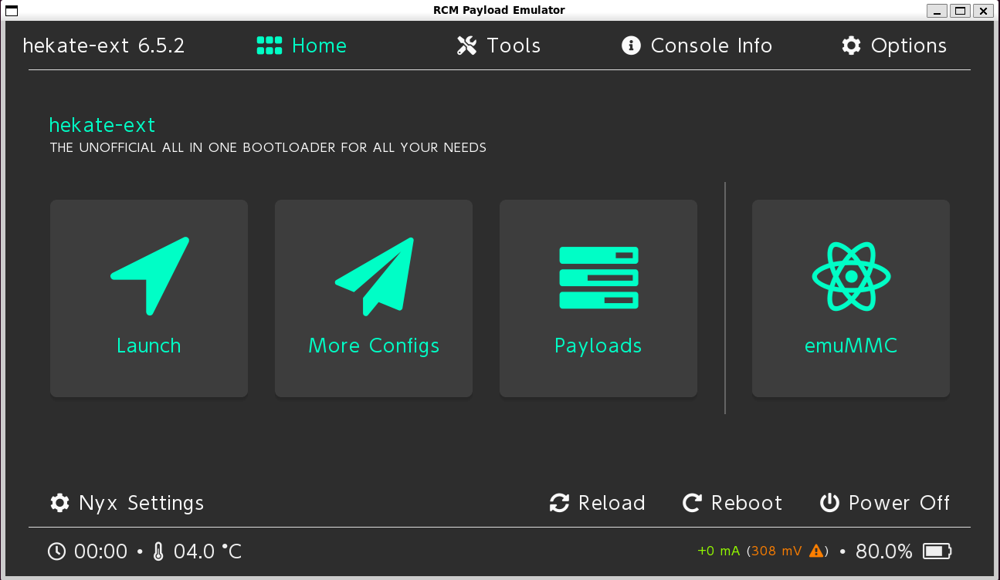
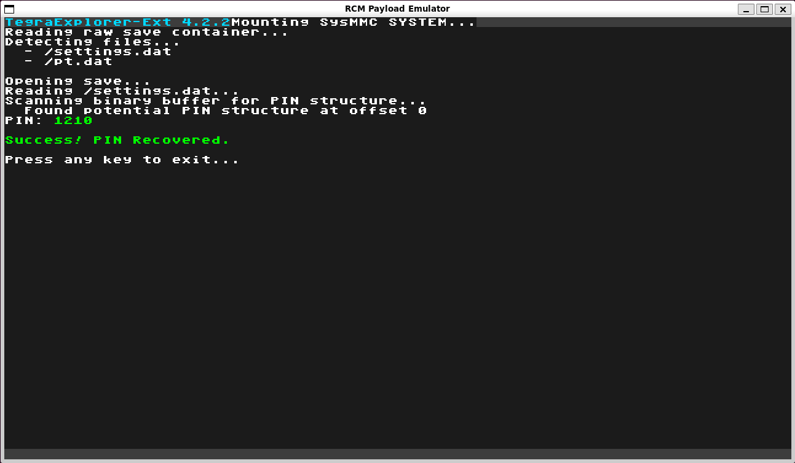
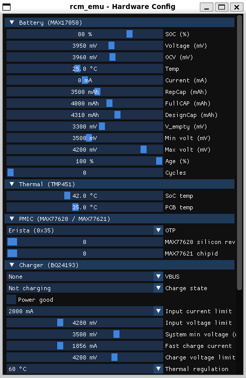
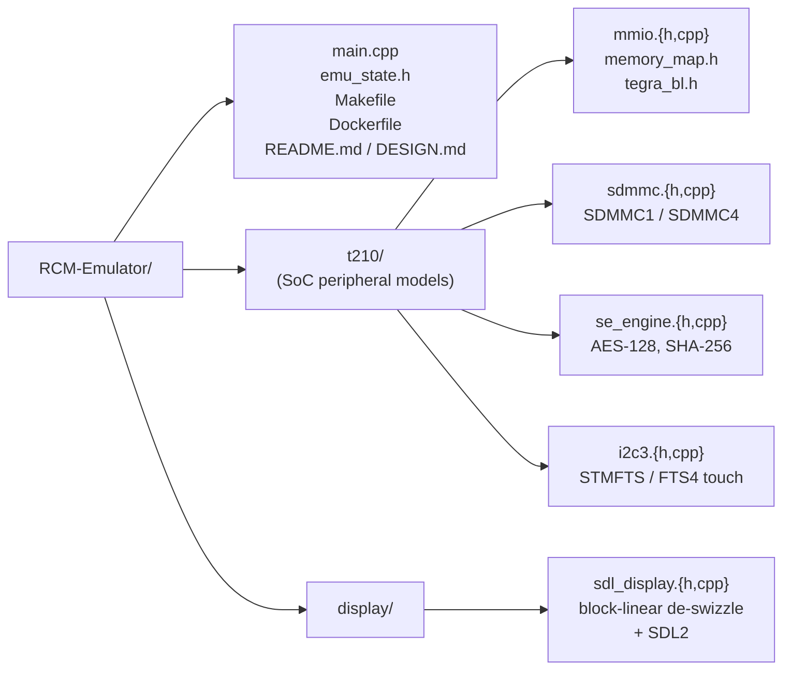

# RCM-Emulator



A host-side emulator for Nintendo Switch RCM (Recovery Mode) payloads. Loads a
precompiled `.bin` (Hekate, Lockpick_RCM, TegraExplorer, custom payloads) and
executes its ARM32 code on an emulated Tegra X1 (T210) environment, with a
windowed framebuffer and keyboard input mapped to the Switch hardware buttons.

It is **not** a console emulator. Only the BPMP (Boot and Power Management
Processor) bootloader stage is modelled. You will not boot Horizon, run NSPs,
or load games. The intended use is payload development and scripted
verification, plus security research where iterating on real hardware would be
slow or destructive.

## What it can do

- Run **Hekate** (CTCaer) through the IPL (Initial Program Loader) warning into
  the Nyx GUI.
- Run **Lockpick_RCM** through key derivation. The `--prod-keys` shortcut
  bypasses the parts of the chain that aren't fully modelled.
- Run **TegraExplorer**, including `.te` script execution from an emulated SD
  card.
- Replay deterministic button sequences via `--auto-pin-recovery` or
  `--auto-te-script`, so a payload flow can be exercised from a CI run or a
  one-shot script.
- Tweak emulated hardware live (battery, charger, thermal, USB-PD, PMIC,
  fuses, SD insertion) from a side window. See [Live hardware tweaks](#live-hardware-tweaks).
- Read real eMMC (embedded MMC) dumps (`BOOT0`, multi-part `rawnand.bin.NN`)
  and decrypt them with XTS-AES-128 (XEX-based Tweaked-codebook with ciphertext
  stealing) against keys from `prod.keys`.
- Serve a real FAT32 SD image to the payload (`--sd sd.img`).

## Quick start

### Build (Linux / WSL)

```bash
sudo apt-get install -y build-essential libunicorn-dev libsdl2-dev
make
```

### Build (Docker)

```bash
docker build -t rcm-emulator .
docker run --rm -v "$(pwd):/work" rcm-emulator
```

### Build an SD image

`make_sd.py` packages a source folder into a FAT32 image you can pass to
`--sd`. It uses Docker (alpine + dosfstools + mtools), so no `sudo` or loop
mounts are needed.

```bash
python3 make_sd.py --src ./sd_root --out sd.img --size-mb 512
```

`./sd_root` is your usual SD card layout (`bootloader/`, `switch/`, etc.).
The result drops in directly as `--sd sd.img`.

#### Build the SD from scratch (HATS + Parental-PIN-RCM)

This produces a fully populated `sd_root` (Hekate + TegraExplorer + the
PIN-recovery script) and bakes it into `sd.img`:

```bash
# 1. Pull the latest HATS release from sthetix.
HATS_URL=$(curl -s https://api.github.com/repos/sthetix/HATS/releases/latest \
    | grep -oE '"browser_download_url": "[^"]+\.zip"' \
    | head -1 | cut -d'"' -f4)
curl -L -o hats.zip "$HATS_URL"
mkdir -p sd_root
unzip -q hats.zip -d sd_root

# 2. Drop the recover_pin.te script into the path TegraExplorer reads
#    (HATS puts it at sd:/scripts/).
git clone --depth 1 https://github.com/Creased/Parental-PIN-RCM
mkdir -p sd_root/scripts
cp Parental-PIN-RCM/recover_pin.te sd_root/scripts/

# 3. Bake everything into a FAT32 image.
python3 make_sd.py --src ./sd_root --out sd.img --size-mb 512
```

HATS already ships `TegraExplorer.bin` under `bootloader/payloads/`, so no
extra payload download is needed.

### Demo: PIN recovery

The screenshot below shows a full parental-PIN recovery run inside the
emulator. Setup:

- `sd.img` was built from a HATS-by-sthetix archive (extracted, then packaged
  with `make_sd.py`).
- The `recover_pin.te` script under `scripts/` on that SD comes
  from [Creased/Parental-PIN-RCM](https://github.com/Creased/Parental-PIN-RCM).
- `backup/BOOT0` and `backup/rawnand.bin.NN` are an eMMC dump produced by
  Hekate (Tools, Backup eMMC).
- `backup/prod.keys` is the keyfile produced by running Lockpick_RCM on the
  same console.

Boot Hekate, then chain-load TegraExplorer from the SD and run the script:

```bash
./rcm_emu ./hekate_ctcaer_6.5.2.bin \
    --sd         ./sd.img \
    --boot0      ./backup/BOOT0 \
    --rawnand    ./backup/rawnand.bin \
    --prod-keys  ./backup/prod.keys
```

In the Nyx GUI: Tools, Launch payload, pick `TegraExplorer.bin`. From the TE
main menu: Scripts, `recover_pin.te`, Recover from sysmmc. The PIN appears in
green:



## Live hardware tweaks

Press `M` in the main window to open a second window that exposes the values
the payload reads from the emulated chips. Edits apply on the next register
read, with no restart and no recompile. Use it to exercise payload code that
branches on hardware state (low-battery warnings, thermal throttling, charger
detect, SD eject, OEM-specific PMIC forks, and similar) without needing the
state to occur on real hardware.



What's tweakable, grouped by chip:

| Chip                    | Bus / addr      | Tweakable                                                                                       |
| ----------------------- | --------------- | ----------------------------------------------------------------------------------------------- |
| **MAX17050** fuel gauge | I2C\_1 @ 0x36   | SOC %, VCELL, OCV, Temp, Current, RepCap, FullCAP, DesignCap, V\_empty, Min/Max volt, Age, Cycles |
| **TMP451** thermal      | I2C\_1 @ 0x4C   | SoC die temp, PCB temp                                                                          |
| **BQ24193** charger     | I2C\_1 @ 0x6B   | VBUS, charge state, power-good, input current/voltage limit, system min, fast-charge current, charge voltage limit, thermal regulation |
| **BM92T36** USB-PD      | I2C\_1 @ 0x18   | Cable-inserted, PDO voltage, PDO amperage                                                       |
| **MAX77620** main PMIC  | I2C\_5 @ 0x3C   | OTP (Erista / Mariko), silicon revision                                                         |
| **MAX77621** CPU/GPU PMIC | I2C\_5 @ 0x1B | Chip ID                                                                                         |
| **Tegra fuses**         | FUSE 0x7000F800 | 5 fuse offsets read by Hekate (SKU info, fuse ID, etc.)                                         |
| **GPIO**                | Port Z bit 1    | SD card insert / eject                                                                          |
| **Display**             | EmuState        | Backlight, rotation override                                                                    |
| **Emulation**           | EmuState        | Pause / resume, button visualization                                                            |

A few example tweaks:

- Drag SOC % down to 5%. The Hekate "low battery" branch fires.
- Drop SoC temp to 95 °C. The thermal-throttle path triggers.
- Toggle VBUS to None and Power good off. Hekate flips to the "no charger"
  state.
- Set Charge voltage limit to 4096 mV. The Battery Info screen reflects it
  on the next poll.
- Toggle SD card inserted off mid-boot. The SD-detect path sees no card,
  which is useful for testing failure handling.
- Switch PMIC OTP to Mariko (0x53). The OEM-detection branch prints
  "Mariko OTP" instead of "Erista OTP".

The full layout (sliders, combos, hex inputs for fuses) lives in
[display/config_window.cpp](display/config_window.cpp). Encoding logic that
maps each user-facing decoded value back to the chip's raw register format
is in [t210/mmio.cpp](t210/mmio.cpp). Each encoder mirrors a corresponding
`*_get_property()` formula in the Hekate `bdk/power/` tree.

## Controls

| Key            | Switch button / action          |
| -------------- | ------------------------------- |
| `↑` / `↓`      | VOL+ / VOL–                     |
| `Enter`        | POWER                           |
| Mouse click    | Touch (Nyx, TE menus)           |
| `M`            | Open / close hardware-config window (see [Live hardware tweaks](#live-hardware-tweaks)) |
| `R`            | Soft reboot                     |
| `P`            | Pause or resume emulation       |
| `Ctrl+R` / `Ctrl+Shift+R` | Cycle display rotation CW / CCW |
| `S`            | Cycle swizzle override          |
| `Esc`          | Quit                            |

## Command-line flags

| Flag                  | Argument      | Purpose                                                   |
| --------------------- | ------------- | --------------------------------------------------------- |
| `--sd`                | `sd.img`      | Back the SD card (SDMMC1) with this raw FAT32 image.      |
| `--boot0`             | `BOOT0`       | eMMC BOOT0 partition file (SDMMC4).                       |
| `--rawnand`           | `rawnand.bin` | eMMC GPP partition prefix (auto-detects `.00`, `.01`, …). |
| `--prod-keys`         | `prod.keys`   | Override BIS keys from a Lockpick-style key file.         |
| `--oem`               | `erista` \| `mariko` | Switch SoC generation. Drives `APB_MISC_GP_HIDREV` so Hekate's `h_cfg.t210b01` matches and pkg1 identification skips the right OEM header. Default `erista`. |
| `--auto-pin-recovery` | (none)        | Drive the Lockpick PIN-recovery menu without user input.  |
| `--auto-te-script`    | (none)        | Drive `recover_pin.te` in TegraExplorer without input.    |

## Repo layout



For implementation details, see [DESIGN.md](DESIGN.md).

## Limitations

- **BPMP only.** Horizon and Atmosphère need A57 core emulation. This only
  models the ARM7 bootloader environment.
- **Subset of MMIO (Memory-Mapped I/O).** Peripherals are modelled to the depth
  required by the payloads above. New payloads may exercise registers that fall
  through to the default catch-all and need handlers added.
- **Key derivation chain is partial.** The TSEC (Tegra Security Co-processor)
  firmware and the full master-key unwrapping flow are not faithfully emulated.
  `--prod-keys` is a pragmatic shortcut: when Lockpick writes a derived BIS
  (Boot Image Storage) key into a keyslot, the value from the user-supplied key
  file is substituted. RSA, RNG, and chunked SHA are stubs.
- **Single-threaded.** The CPU runs in batches on the main thread between SDL
  event polls. Tight host CPU loops will starve the display refresh.

## Acknowledgements

Heavy reliance on the work of:

- [Unicorn Engine](https://www.unicorn-engine.org/) for CPU emulation.
- [Hekate / BDK](https://github.com/CTCaer/hekate) as peripheral and
  key-derivation reference.
- [Lockpick_RCM](https://github.com/shchmue/Lockpick_RCM) for keyslot
  semantics.
- [TegraExplorer](https://github.com/suchmememanyskill/TegraExplorer) for the
  `.te` script harness.
- TinyAES (kokke) for the AES-128 reference implementation.
